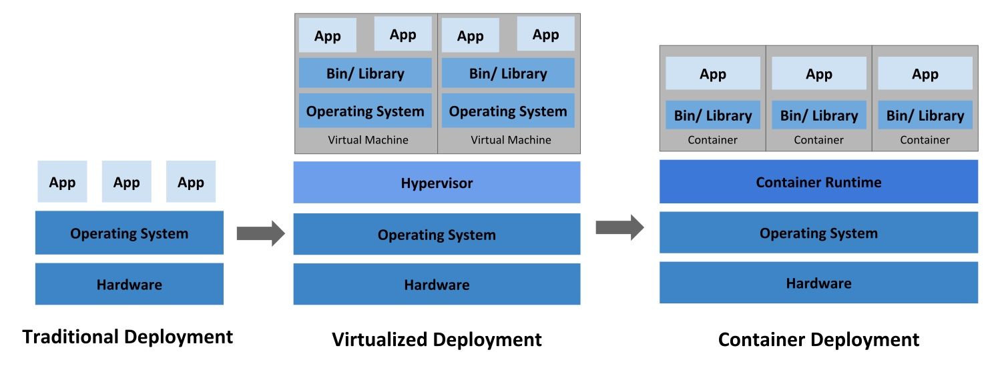
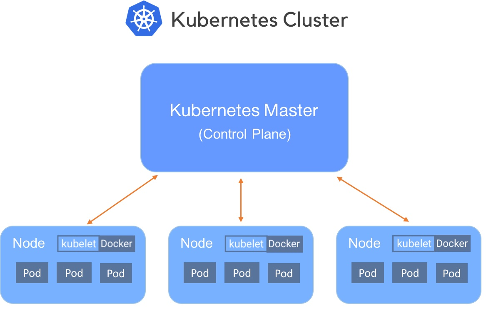

# Containerization and Kubernetes

Containers offer a logical packaging mechanism in which applications can be abstracted from the environment in which
they actually run. This decoupling allows container-based applications to be deployed consistently, regardless of
whether the target environment is a private data center, the public cloud, or even a developer’s personal laptop.
Containerization provides a clean separation of concerns, as developers focus on their application logic and
dependencies, while IT operations teams can focus on deployment and management without bothering with application
details such as specific software versions and configurations specific to the app.

The portability and reproducibility of a containerized process mean we have an opportunity to move and scale our
containerized applications across clouds and data centers. Furthermore, as we scale our applications up, we’ll want some
tools to help automate the maintenance of those applications, able to replace failed containers automatically and manage
the rollout of updates and reconfigurations of those containers during their lifecycle. Tools to manage, scale, and
maintain containerized applications are called **orchestrators**.

## The problems for developers

- Consistent environment  
  Ability to create predictable environments that are isolated from other applications.
- Run anywhere  
  Ability to run virtually anywhere: on Linux, Windows, and Mac operating systems; on virtual machines or bare metal; on
  a developer’s machine or in data centers on-premises; in the public cloud.
- Isolation  
  Ability to virtualize CPU, memory, storage, and network resources at the OS level, providing developers with a
  sandboxed view of the OS logically isolated from other applications.

## Container definition

- Standardized unit of software that allows developers to isolate their application from its environment.
- Packages code and all its dependencies, so that the application runs quickly and reliably from one computing
  environment to another.
- Images and runtimes are standardized by the [Open Container Initiative (OCI)](https://opencontainers.org/): an image
  built with one tool runs with any compliant runtime.
- Container tools:
  - **Docker** and **Podman**: build and run containers on a workstation
  - **containerd** and **CRI-O**: container runtimes used by Kubernetes nodes
  - LXC (Linux Containers): system containers

## Container vs Virtual Machines vs Bare metal



## Requirements for Container-Based applications

- Manage containers
- Ensure that there is no downtime (SLA requirement)

## Container orchestration services

- Deployment
- Management
- Scaling
- Networking

## Containers complexity

- Provisioning and deployment
- Configuration and scheduling
- Resource allocation
- Container availability
- Scaling or removing containers based on balancing workloads across your infrastructure
- Load balancing and traffic routing
- Monitoring container health
- Configuring applications based on the container in which they will run
- Keeping interactions between containers secure

## Container orchestration tools

- **Kubernetes** and its distributions (OpenShift, Rancher, managed services such as EKS, AKS, GKE)
- HashiCorp Nomad
- Docker Swarm

Docker Compose runs multi-container applications on a single host. It is convenient for development but it is not a
cluster orchestrator.

## Cloud-native and Kubernetes

> Cloud native practices empower organizations to develop, build, and deploy workloads in computing environments
> (public, private, hybrid cloud) to meet their organizational needs at scale in a programmatic and repeatable manner.
> It is characterized by loosely coupled systems that interoperate in a manner that is secure, resilient, manageable,
> sustainable, and observable.

> Cloud native technologies and architectures typically consist of some combination of containers, service meshes,
> multi-tenancy, microservices, immutable infrastructure, serverless, and declarative APIs — this list is
> non-exhaustive.

[CNCF Cloud Native Definition v1.0](https://github.com/cncf/toc/blob/main/DEFINITION.md)

**Note**: The definition is not related to the cloud per se, but to application architecture. A cloud-native platform
can run on-premises.

Kubernetes, one specific implementation of cloud-native orchestration, is an open-source system for automating
deployment, scaling, and management of containerized applications.

## Kubernetes features

- Automated rollouts and rollbacks
- Service health monitoring
- Automatic scaling of services
- Declarative management
- Deploy anywhere, including hybrid deployments
- Storage orchestration

## Kubernetes cluster

- Control plane: coordinates the cluster (API server, scheduler, controller manager, etcd)
- Nodes: workers that run applications (kubelet, container runtime, kube-proxy)



The diagram uses the former "master" terminology, now named control plane. Docker is no longer the runtime used by
Kubernetes nodes, it was replaced by containerd or CRI-O.

[Kubernetes components](https://kubernetes.io/docs/concepts/overview/components/)

## Kubernetes objects definitions

**Kubernetes objects** - persistent entities in the Kubernetes system. Kubernetes uses these entities to represent the
state of the cluster:

- Running containers
- Available resources
- Policies

**Objects:**

- Pod
- Deployment
- Service
- ...

[Read more about Kubernetes
objects](https://kubernetes.io/docs/concepts/overview/working-with-objects/kubernetes-objects/)

### Kubernetes Objects: Namespaces

Namespaces isolate groups of objects inside a single cluster. Object names are unique within a namespace, and access
control (RBAC), quotas and network policies are defined per namespace.

```bash
kubectl create namespace lab
kubectl -n lab get pods
```

A common practice is to use one namespace per team, per application, or per environment. On a shared platform such as
Onyxia, each user works in a personal namespace.

### Kubernetes Objects: Pods

**Pods** are (an abstraction of containers):

- the smallest deployable units of computing
- group of one or more containers (tightly coupled)
- ephemeral, disposable entities (The Pod remains on the node until the Pod finishes execution, the Pod object is
  deleted, the Pod is evicted for lack of resources, or the node fails.)
- not replicated by themselves: controllers such as Deployments create and replace identical Pods

Example of `.yaml` (or `.yml`) file:

```yaml
apiVersion: v1
kind: Pod
metadata:
  name: redis
spec:
  containers:
    - name: redis
      image: redis:8.0
      volumeMounts:
        - name: redis-storage
          mountPath: /data/redis
  volumes:
    - name: redis-storage
      emptyDir: {}
```

### Kubernetes Objects: Deployment

Provides declarative updates for Pods (an abstraction of Pods).

You describe a **desired state** in a Deployment, and the Deployment Controller changes the actual state to the desired
state.

Example:

```yaml
apiVersion: apps/v1
kind: Deployment
metadata:
  name: nginx-deployment
spec:
  selector:
    matchLabels:
      app: nginx
  replicas: 2 # tells deployment to run 2 pods matching the template
  template:
    metadata:
      labels:
        app: nginx
    spec:
      containers:
        - name: nginx
          image: nginx:1.29
          ports:
            - containerPort: 80
```

[Read more](https://kubernetes.io/docs/concepts/workloads/controllers/deployment/)

### Kubernetes Objects: Service

An abstract (abstraction of network) way to expose an application running on a set of Pods **as a network service**.

With Kubernetes you don't need to modify your application to use an unfamiliar service discovery mechanism. Kubernetes
gives Pods their own IP addresses and a single DNS name for a set of Pods and can load-balance across them.

Example, exposing the Pods of the previous Deployment:

```yaml
apiVersion: v1
kind: Service
metadata:
  name: nginx-service
spec:
  selector:
    app: nginx
  ports:
    - protocol: TCP
      port: 8080 # port of the Service
      targetPort: 80 # port of the container
```

Service types:

- `ClusterIP` (default): reachable only from inside the cluster
- `NodePort`: reachable on a static port of every node
- `LoadBalancer`: provisions an external load balancer (cloud provider or MetalLB)

[Read more](https://kubernetes.io/docs/concepts/services-networking/service/)

### Kubernetes Objects: ConfigMap and Secret

Applications must not embed their configuration inside the image. Kubernetes provides two objects to inject it at
runtime, as environment variables or as files mounted in the container.

A **ConfigMap** stores non-sensitive configuration data as key-value pairs or entire files:

- Application settings (database host, log level, timeouts)
- Feature flags
- Configuration files (`application.yaml`, `app.properties`)
- Data pipeline parameters (batch size, retention days)

A **Secret** stores sensitive data:

- Passwords and access keys
- OAuth tokens, API keys
- SSH keys and TLS certificates
- Cloud provider credentials (AWS, Azure, Ceph S3 access)

Secret values are **base64-encoded, which is not encryption**:

- Anyone allowed to read Secrets in the namespace can decode them
- Encryption at rest must be enabled in etcd for production clusters
- Plain Secret manifests must never be committed to Git. Use tools such as [Sealed
  Secrets](https://github.com/bitnami-labs/sealed-secrets), the [External Secrets
  Operator](https://external-secrets.io/) or HashiCorp Vault.

[Read more](https://kubernetes.io/docs/concepts/configuration/secret/)

### Kubernetes Objects: Job and CronJob

Deployments run long-lived services, restarted forever. Data processing is often a batch task which must run to
completion.

- **Job**: creates one or more Pods and retries them until a given number complete successfully.
  - `backoffLimit`: number of retries before the Job is marked as failed
  - `activeDeadlineSeconds`: maximum duration of the Job, including image pulls and retries
  - `parallelism` and `completions`: run several Pods in parallel
  - `completionMode: Indexed`: each Pod receives an index (`JOB_COMPLETION_INDEX`) to process a distinct shard of the
    data
  - `ttlSecondsAfterFinished`: automatic cleanup of finished Jobs
- **CronJob**: creates Jobs on a schedule expressed with the cron syntax (`0 2 * * *` = 2 AM daily).
  - `concurrencyPolicy`: allow, forbid or replace overlapping runs
  - `timeZone`: time zone of the schedule

```yaml
apiVersion: batch/v1
kind: CronJob
metadata:
  name: nightly-ingestion
spec:
  schedule: "0 2 * * *"
  timeZone: Europe/Paris
  concurrencyPolicy: Forbid
  jobTemplate:
    spec:
      backoffLimit: 2
      template:
        spec:
          restartPolicy: Never
          containers:
            - name: ingest
              image: busybox:1.37
              command: ["sh", "-c", "echo ingesting data"]
```

[Read more](https://kubernetes.io/docs/concepts/workloads/controllers/job/)

### Kubernetes Objects: StatefulSet

Deployments consider Pods as interchangeable. Databases and distributed systems such as Kafka need:

- a stable network identity (`kafka-0`, `kafka-1`, ...)
- a dedicated persistent volume per Pod which follows the Pod when it is rescheduled
- ordered deployment, scaling and updates

StatefulSets provide these guarantees. Persistent volumes are detailed in the storage module.

[Read more](https://kubernetes.io/docs/concepts/workloads/controllers/statefulset/)

## Resource requests and limits

Each container declares the resources it needs:

- **requests**: resources reserved for the container, used by the scheduler to select a node with enough capacity
- **limits**: maximum resources the container may consume. A container exceeding its memory limit is killed
  (`OOMKilled`), CPU above the limit is throttled.

```yaml
resources:
  requests:
    cpu: 500m # half a CPU core
    memory: 1Gi
  limits:
    memory: 2Gi
```

Sizing matters for data workloads: a Spark executor without enough memory is killed and its tasks are recomputed, while
oversized requests waste cluster capacity.

[Read more](https://kubernetes.io/docs/concepts/configuration/manage-resources-containers/)

## Operators and Custom Resource Definitions

Kubernetes can be extended with new object types:

- A **Custom Resource Definition (CRD)** declares a new kind of object, for example `KafkaTopic` or `SparkApplication`.
- An **operator** is a controller which watches these custom resources and performs the operational tasks a human
  administrator would do: deploy, configure, upgrade, back up, recover.

Most data platforms components used in this course are deployed with operators: Strimzi for Kafka, the Spark Operator
for Spark, Rook for Ceph.

```yaml
apiVersion: kafka.strimzi.io/v1beta2
kind: KafkaTopic
metadata:
  name: orders
  labels:
    strimzi.io/cluster: my-cluster
spec:
  partitions: 3
  replicas: 3
```

[Read more](https://kubernetes.io/docs/concepts/extend-kubernetes/operator/)

## Helm

[Helm](https://helm.sh/) is the package manager of Kubernetes. A chart is a set of templated manifests with default
values. Operators and applications are commonly installed with Helm:

```bash
helm repo add strimzi https://strimzi.io/charts/
helm install strimzi-operator strimzi/strimzi-kafka-operator --namespace kafka --create-namespace
```

## Kubernetes object management

| Management technique             | Operates on          | Recommended environment |
| -------------------------------- | -------------------- | ----------------------- |
| Imperative commands              | Live objects         | Development projects    |
| Imperative object configuration  | Individual files     | Production projects     |
| Declarative object configuration | Directories of files | Production projects     |

**Examples:**

Imperative commands:

```bash
kubectl create deployment nginx --image nginx
```

Imperative object configuration:

```bash
kubectl create -f nginx.yaml
kubectl delete -f nginx.yaml -f redis.yaml
```

Declarative object configuration:

```bash
kubectl apply -f path/to/folder/
```

[Read more](https://kubernetes.io/docs/concepts/overview/working-with-objects/object-management/)

## Resource configuration organization

```
project/k8s/development
├── deployment
│   └── my-deployment.yaml
└── service
    └── my-service.yaml
```

[Read more about managing resources](https://kubernetes.io/docs/concepts/cluster-administration/manage-deployment/)

## Pod storage

Kubernetes volumes:

- similar to Docker volumes
- many types supported

Volume types:

- `emptyDir` - ephemeral (exist as long as Pod is running on that Node)
- `hostPath` - mounts a directory from the Node
- `configMap` and `secret` - expose configuration as files
- `persistentVolumeClaim` - durable storage, detailed in the storage module
- ... many of other types

[Read more](https://kubernetes.io/docs/concepts/storage/volumes/)

## Networking

Communications types:

1. Highly-coupled container-to-container  
   Solved by Pods and `localhost`
2. Pod-to-Pod  
   Pods on a node can communicate with all pods on all nodes
3. Pod-to-Service  
   Covered by Services
4. External-to-Service  
   Covered by `NodePort` and `LoadBalancer` Services, Ingress, and its successor the Gateway API

[Read more](https://kubernetes.io/docs/concepts/cluster-administration/networking/)

## minikube

- Tool that makes it easy to run Kubernetes locally
- Runs a single-node Kubernetes cluster inside a container (Docker driver, the default) or a Virtual Machine
- Perfect to get started with Kubernetes or develop locally

## References

- [Kubernetes concepts](https://kubernetes.io/docs/concepts/)
- [Killercoda - Learn Kubernetes using Interactive Browser-Based
  Scenarios](https://killercoda.com/playgrounds/scenario/kubernetes)

---

_The content of this document, including all text, images, and associated materials, is the exclusive property of
Adaltas and is protected by applicable copyright laws. Unauthorized distribution, reproduction, or sharing of this
content, in whole or in part, is strictly prohibited without the express written consent of the author(s). Any violation
of this restriction may result in legal action and the imposition of penalties as prescribed by law._
